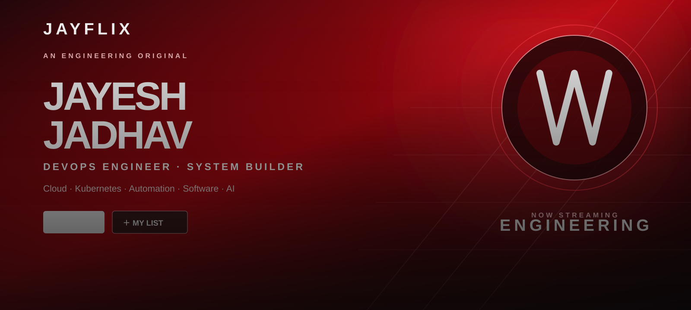
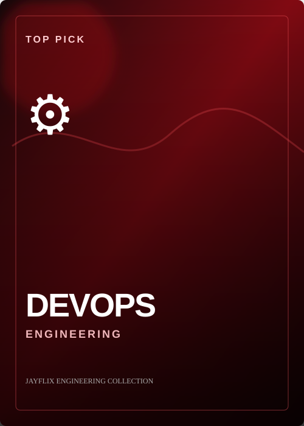
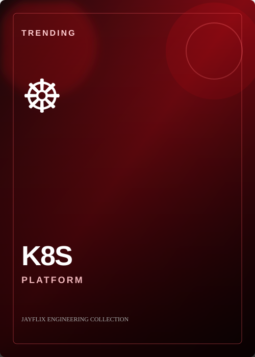
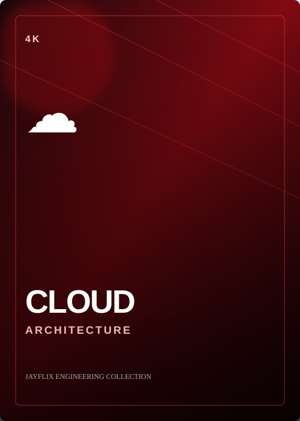
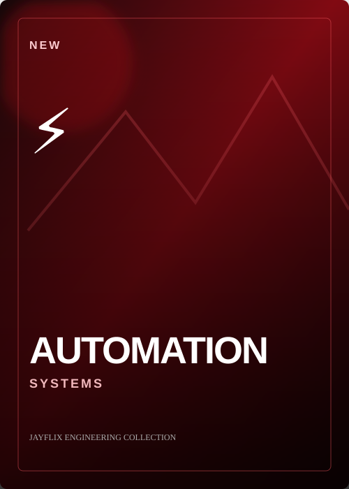
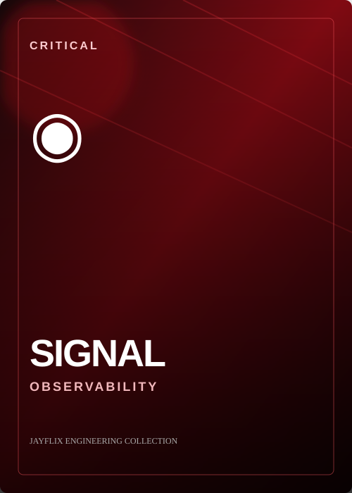
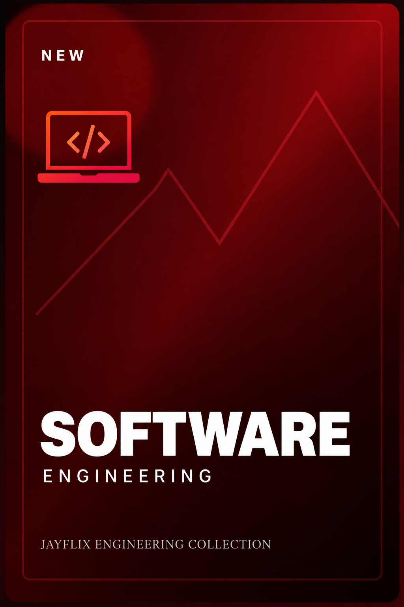
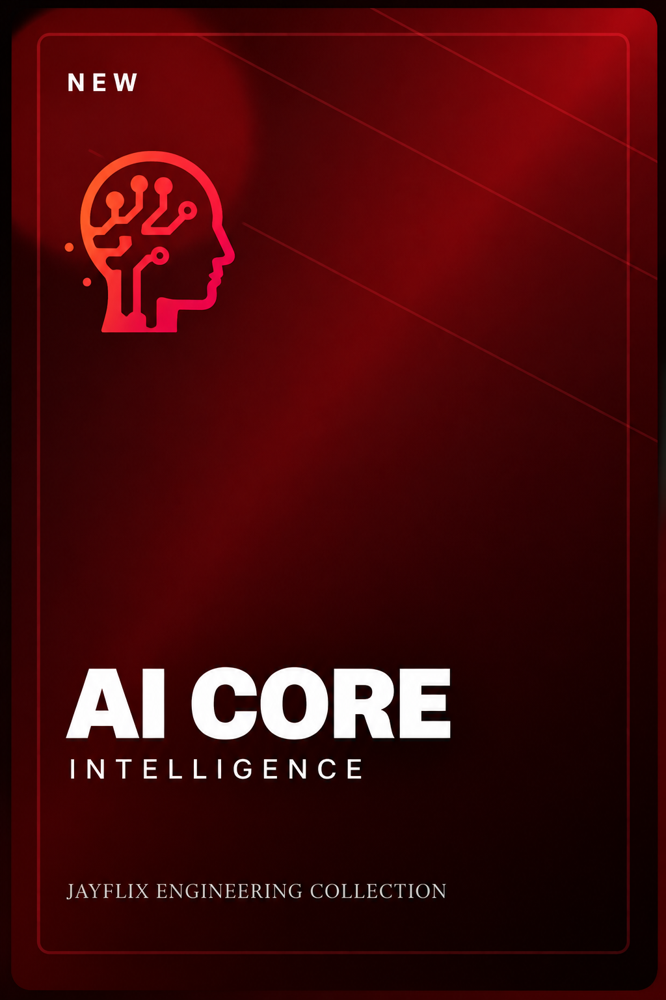
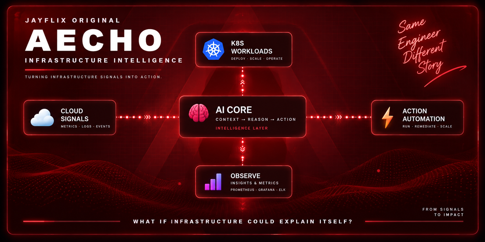

<div align="center">



</div>

<div align="center">

[](#)
[](#)
[](#)
[](#)

</div>

---

# 🍿 WHO'S WATCHING?

<table>
<tr>
<td align="center" width="33%">

## 👨‍💻 ENGINEER

Cloud · K8s · CI/CD  
Automation · Software

**[▶ Explore](#-continue-watching)**

</td>
<td align="center" width="33%">

## 🧑‍💼 RECRUITER

Engineering · Skills  
Systems · Projects

**[▶ Explore](#-top-picks-for-you)**

</td>
<td align="center" width="33%">

## 🤖 AI SYSTEM

AECHO · Architecture  
Context · Automation

**[▶ Explore](#-jayflix-original--aecho)**

</td>
</tr>
</table>

<div align="center">


</div>

# ▶️ CONTINUE WATCHING

<table>
<tr>
<td width="33%" align="center">



**Season 01 · Episode 01**  
`██████████████████░░ 92%`

</td>
<td width="33%" align="center">



**Season 01 · Episode 02**  
`████████████████░░░░ 84%`

</td>
<td width="33%" align="center">



**Season 01 · Episode 03**  
`█████████████████░░░ 88%`

</td>
</tr>
</table>

> **DevOps engineering:** building and operating delivery systems across cloud, Kubernetes, CI/CD, infrastructure, observability and automation.

---

# 🔥 TOP PICKS FOR YOU

<table>
<tr>
<td width="25%" align="center"><br><b>⚡ AUTOMATION</b></td>
<td width="25%" align="center"><br><b>🔭 OBSERVABILITY</b></td>
<td width="25%" align="center"><br><b>💻 SOFTWARE</b></td>
<td width="25%" align="center"><br><b>🤖 AI CORE</b></td>
</tr>
</table>

### 🎯 ENGINEERING STACK

**☁️ Cloud** — AWS · Azure · Networking · Compute · Security · Architecture

**☸️ Platform** — Kubernetes · Docker · Helm · Workloads · Services · Scaling

**⚙️ Delivery** — Git · GitHub Actions · Jenkins · GitLab CI/CD · Harness

**🏗️ Infrastructure** — Terraform · Ansible · Linux · Infrastructure as Code

**🔭 Observability** — Prometheus · Grafana · Logs · Metrics · Traces · Alerts

**💻 Software** — Python · Java · Node.js · APIs · Bash · Git

**🗄️ Data / Messaging** — PostgreSQL · MongoDB · Redis · RabbitMQ

---

# 🧠 AI CORE

```text
                         ┌──────────────────────┐
                         │       🧠 AI CORE     │
                         │                      │
                         │   CONTEXT            │
                         │   REASON              │
                         │   PLAN                │
                         │   EXECUTE             │
                         └──────────┬───────────┘
                                    │
                  ┌─────────────────┼─────────────────┐
                  ▼                 ▼                 ▼
                LLMs               RAG             AGENTS
                  │                 │                 │
                  └─────────────────┼─────────────────┘
                                    ▼
                           TOOL / API EXECUTION
                                    │
                     ┌──────────────┼──────────────┐
                     ▼              ▼              ▼
                   ☁️ CLOUD        ☸️ K8S          🐙 GIT
                     │              │              │
                     └──────────────┼──────────────┘
                                    ▼
                           DEVOPS AUTOMATION
```

**Exploring:** `LLMs` · `RAG` · `AI Agents` · `AI-assisted DevOps` · `Infrastructure Intelligence`

---

# 🚀 JAYFLIX ORIGINAL — AECHO

<div align="center">



</div>

### 🎬 THE QUESTION

> **Can AI understand an engineering environment as a connected system?**

AECHO is an evolving engineering R&D project exploring infrastructure intelligence.

```text
OBSERVE
   ↓
UNDERSTAND
   ↓
CORRELATE
   ↓
REASON
   ↓
RECOMMEND
   ↓
AUTOMATE
```

### 🧩 THE SYSTEM

```text
CLOUD ───────┐
KUBERNETES ──┼──► OBSERVABILITY ──► SYSTEM GRAPH ──► AI CORE
IaC ─────────┘                                      │
                                                    ├──► INSIGHT
                                                    └──► ACTION
```

**AECHO is presented as an engineering project — not a founder/company identity.**

---


# 🎭 BROWSE BY GENRE

| Genre | What you'll find |
|---|---|
| ☁️ **Cloud** | Architecture, compute, networking, reliability |
| ☸️ **Kubernetes** | Containers, workloads, platform engineering |
| ⚙️ **DevOps** | CI/CD, IaC, deployment automation |
| 🔭 **Observability** | Metrics, logs, traces, incident response |
| 💻 **Software** | Python, Java, APIs, Linux, tooling |
| 🤖 **AI** | LLMs, RAG, agents, AI automation |
| 🧪 **Experiments** | Labs, prototypes, architecture explorations |

---

# 🧪 MY LIST

```text
⭐ Kubernetes Labs
⭐ CI/CD Experiments
⭐ Infrastructure Automation
⭐ Cloud Architecture
⭐ Observability Labs
⭐ AI Engineering Experiments
⭐ Developer Tooling
⭐ AECHO
```

The engineering loop:

```text
IDEA → EXPERIMENT → PROTOTYPE → BREAK → DEBUG → REFACTOR → SHIP → OBSERVE
```

---

# 🚨 INCIDENT MODE

```text
                    🚨 ALERT
                       │
                       ▼
                    🔭 SIGNAL
                       │
          ┌────────────┼────────────┐
          ▼            ▼            ▼
        📜 LOGS      📊 METRICS    📨 EVENTS
          │            │            │
          └────────────┼────────────┘
                       ▼
                    🔗 CORRELATE
                       │
                       ▼
                    🧩 ROOT CAUSE
                       │
                       ▼
                      🔧 FIX
                       │
                       ▼
                   ⚙️ AUTOMATE
                       │
                       ▼
                    🛡️ PREVENT
```

A good incident response fixes the problem.

A better one reduces the probability of the next occurrence.

---

# 🎤 CREATOR SPECIAL

<div align="center">


### 📱 `@jaymarathicareer`

**Career · Technology · Opportunities**

A separate creator channel by Jayesh.

</div>

My professional identity here is **DevOps Engineer**.  
My creator side lives at **JayMarathi Career**.

---

# 📊 GITHUB ACTIVITY

<div align="center">


</div>

---

# 🎬 FINAL EPISODE

<div align="center">


**[💻 GitHub](https://github.com/jjadhav799)** · **[📱 @jaymarathicareer](https://www.instagram.com/jaymarathicareer/)**

</div>

<details>
<summary>🍿 <b>Post-credit scene</b></summary>

```text
jayesh@jayflix:~$ systemctl status curiosity

● curiosity.service
   Loaded: loaded
   Active: running
   Restart: always

jayesh@jayflix:~$ echo "next episode?"

AECHO
```

</details>

<div align="center">

### `JAYFLIX // ENGINEERING // ALWAYS BUILDING`

🍿 **Thanks for watching.**

</div>
