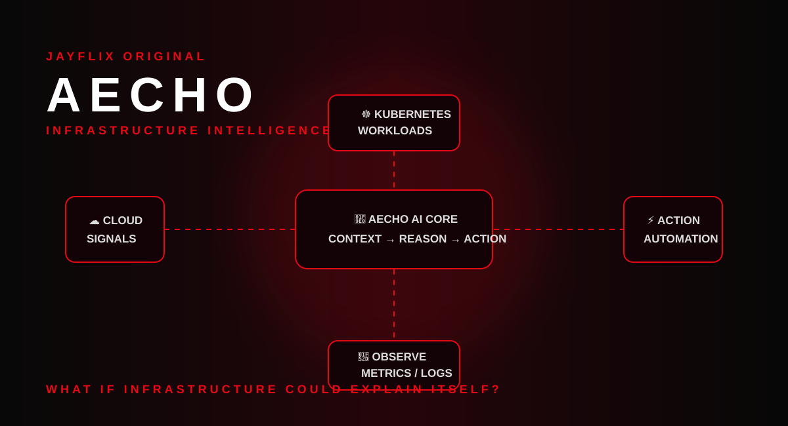
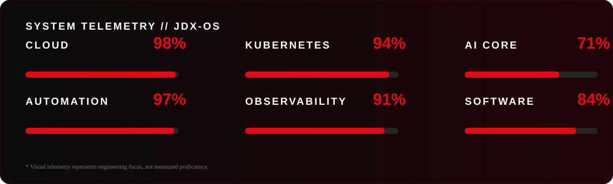
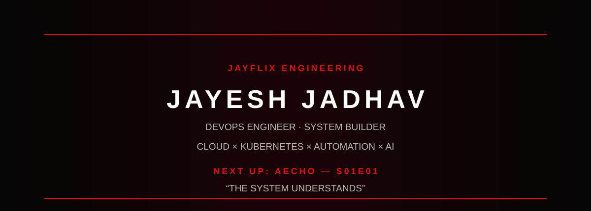

<div align="center">



<br>

[](#)
[](#)
[](#)
[](#)

</div>

---

# 🎬 JAYFLIX

> **A cinematic engineering profile by Jayesh Jadhav.**

**DevOps Engineer • Cloud • Kubernetes • Automation • Software • AI**

<div align="center">

### 🍿 WHO'S WATCHING?

| 👨‍💻 **ENGINEER** | 🧑‍💼 **RECRUITER** | 🤖 **AI SYSTEM** |
|:---:|:---:|:---:|
| Cloud · K8s · CI/CD | Experience · Skills | AECHO · Architecture |
| [Explore](#-continue-watching) | [Explore](#-top-picks-for-you) | [Explore](#-jayflix-original--aecho) |

</div>

---

## ▶️ CONTINUE WATCHING

### 🎞️ DEVOPS ENGINEERING
**Season 01 · Episode 01 · 4K**

Building and operating delivery systems across cloud, Kubernetes, CI/CD, infrastructure, observability and automation.

`██████████████████░░  92%`

### 🎞️ SOFTWARE ENGINEERING
**Season 01 · Episode 02 · 4K**

Python · Java · APIs · Linux · Git · scripting · developer tooling.

`███████████████░░░░░  84%`

### 🎞️ AI ENGINEERING
**NEW · Season 01 · Episode 03 · 4K**

LLMs · RAG · AI agents · AI-assisted DevOps · infrastructure intelligence.

`████████████░░░░░░░░  71%`

---

# 🔥 TOP PICKS FOR YOU

<table>
<tr>
<td width="33%" valign="top">

### ☁️ CLOUD

**2026 · Infrastructure · 4K**

AWS · Azure · networking · compute · security · architecture

</td>
<td width="33%" valign="top">

### ☸️ KUBERNETES

**2026 · Platform · 4K**

Docker · workloads · services · Helm · scaling · operations

</td>
<td width="33%" valign="top">

### ⚙️ AUTOMATION

**2026 · DevOps · 4K**

CI/CD · IaC · Python · Bash · deployment automation

</td>
</tr>
<tr>
<td valign="top">

### 🔭 OBSERVABILITY

**2026 · Engineering · 4K**

Metrics · logs · traces · alerts · troubleshooting

</td>
<td valign="top">

### 💻 SOFTWARE

**2026 · Software · 4K**

Python · Java · APIs · Linux · Git · tooling

</td>
<td valign="top">

### 🤖 AI

**NEW · AI · 4K**

LLMs · RAG · agents · AI automation · context systems

</td>
</tr>
</table>

---

# 🚀 JAYFLIX ORIGINAL — AECHO

<div align="center">



### **AECHO**

**2026 · AI · Infrastructure · Experimental · 4K**

> **What if infrastructure could explain itself?**

</div>

AECHO is my evolving engineering project exploring how AI can understand complex software and infrastructure environments as a connected system.

```text
                         ┌─────────────────────┐
                         │        AECHO        │
                         │ INFRASTRUCTURE INTEL │
                         └──────────┬──────────┘
                                    │
              ┌─────────────────────┼─────────────────────┐
              ▼                     ▼                     ▼
            ☁️ CLOUD              ☸️ K8S                🏗️ IaC
              │                     │                     │
              └─────────────────────┼─────────────────────┘
                                    ▼
                           🔭 OBSERVABILITY
                                    │
                                    ▼
                             🕸️ SYSTEM GRAPH
                                    │
                                    ▼
                               🧠 AI CORE
                                    │
                          ┌─────────┴─────────┐
                          ▼                   ▼
                       💡 INSIGHT          ⚡ ACTION
```

### 🎬 THE STORY

```text
OBSERVE
   ↓
UNDERSTAND
   ↓
CORRELATE
   ↓
REASON
   ↓
RECOMMEND
   ↓
AUTOMATE
```

AECHO is deliberately presented here as an **engineering R&D project**, not a founder/company identity.

---

# 🧠 NEW & HOT

<div align="center">

| 🔥 | TITLE | STATUS |
|---|---|---|
| 🤖 | AI Agents | `EXPLORING` |
| 🧠 | LLM Engineering | `EXPLORING` |
| 🔎 | RAG | `BUILDING` |
| ⚙️ | AI × DevOps | `BUILDING` |
| 🕸️ | Infrastructure Intelligence | `AECHO` |

</div>

---

# 🎭 BROWSE BY GENRE

`☁️ Cloud` · `☸️ Kubernetes` · `⚙️ DevOps` · `🤖 AI` · `💻 Software` · `🔭 Observability` · `🏗️ Architecture` · `🧪 Experiments` · `📦 Automation`

---

# 🧪 MY LIST

```text
⭐ Kubernetes Labs
⭐ CI/CD Experiments
⭐ Infrastructure Automation
⭐ Cloud Architecture
⭐ Observability Labs
⭐ AI Engineering Experiments
⭐ Developer Tooling
⭐ AECHO
```

The repositories behind this profile are my engineering laboratory:

```text
IDEA → EXPERIMENT → PROTOTYPE → BREAK → DEBUG → REFACTOR → SHIP → OBSERVE
```

---

# 📡 SYSTEM TELEMETRY

<div align="center">



</div>

---

# 🍿 TRENDING NOW

### #01 ☸️ Kubernetes
Containerized workloads, deployment patterns, services, scaling and platform operations.

### #02 🤖 AI × DevOps
Using AI where it can remove repetitive engineering work and increase system context.

### #03 ☁️ Cloud
Designing systems around reliability, automation, security and operational visibility.

### #04 🔭 Observability
Metrics + logs + traces → signal → diagnosis → prevention.

### #05 🧪 AECHO
Exploring infrastructure intelligence as an engineering problem.

---

# 🎬 BEHIND THE SYSTEM

I'm **Jayesh Jadhav**, a **DevOps Engineer** interested in the intersection of software, infrastructure and automation.

I don't see DevOps as a list of tools.

```text
TOOLS CHANGE.
ENGINEERING PROBLEMS DON'T.

DELIVERY
RELIABILITY
SCALE
OBSERVABILITY
AUTOMATION
FEEDBACK
```

The question I keep coming back to:

> **How can we build systems that require less repetitive human intervention while becoming easier to understand and operate?**

---

# 📺 INCIDENT MODE

```text
                  🚨 PRODUCTION ALERT
                           │
                           ▼
                      🔭 OBSERVE
                           │
              ┌────────────┼────────────┐
              ▼            ▼            ▼
            📜 LOGS      📊 METRICS    📨 EVENTS
              │            │            │
              └────────────┼────────────┘
                           ▼
                       🔗 CORRELATE
                           │
                           ▼
                       🧩 ROOT CAUSE
                           │
                           ▼
                         🔧 FIX
                           │
                           ▼
                       ⚙️ AUTOMATE
                           │
                           ▼
                      🛡️ PREVENT
```

A good incident response fixes the problem.

A better one makes the next occurrence less likely.

---

# 🎤 CREATOR SPECIAL

<div align="center">

### 📱 `@jaymarathicareer`

**Career · Technology · Opportunities**

🎬 **A separate creator channel by Jayesh**

</div>

My professional identity is **DevOps Engineer**.

My creator side shares career and technology content through **JayMarathi Career**.

---

# 📊 GITHUB ACTIVITY

> Replace `jjadhav799` below with your actual GitHub username.

<div align="center">


</div>

---

# 🎞️ FINAL EPISODE

<div align="center">



### `JAYESH JADHAV`

**DEVOPS ENGINEER · SYSTEM BUILDER**

☁️ Cloud × ☸️ Kubernetes × ⚙️ Automation × 🤖 AI

### NEXT UP

## `AECHO — S01E01`

**"THE SYSTEM UNDERSTANDS"**

[▶️ GitHub](https://github.com/) · [💼 LinkedIn](https://www.linkedin.com/) · [📱 @jaymarathicareer](https://www.instagram.com/jaymarathicareer/)

</div>

---

<details>
<summary>🍿 <b>Post-credit scene</b></summary>

<br>

```text
jayesh@jayflix:~$ systemctl status curiosity

● curiosity.service
   Loaded: loaded
   Active: running
   Restart: always

jayesh@jayflix:~$ echo "next episode?"

AECHO
```

</details>

---

<div align="center">

### `JAYFLIX // ENGINEERING // ALWAYS BUILDING`

🍿 **Thanks for watching.**

</div>
